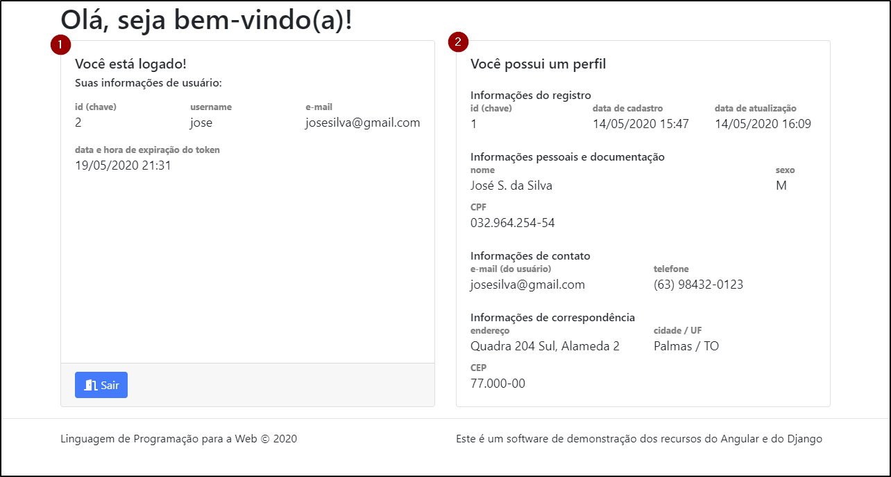
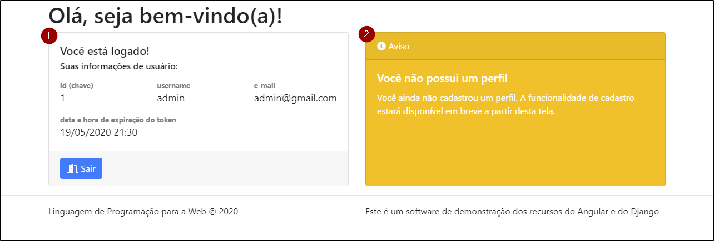

# Perfil

O componente `PerfilComponent` apresenta a tela de perfil do usuário, como ilustra a figura a seguir.

A figura demonstra que há dois paineis (cards) representando conteúdo da tela:

1. **painel de informações do usuário**: apresenta identificador, nome de usuário, e-mail e data e hora da expiração do token
2. **painel de informações do perfil**: apresenta identificador, data de cadastro, data de atualização, nome, sexo, CPF, e-mail, telefone, endereço, cidade, UF e CEP

Quando o componente é acessado seu controller verifica se o usuário está logado, utilizando o método `AuthService.user()`. Se estiver logado, então recupera as informações do perfil, utilizando o método `PerfilService.perfilLogado()`. Caso contrário redireciona para a tela [Login](login.md).

Se o usuário tocar o botão "Sair" o controller chama o método `AuthService.logout()`, que encerra a sessão do usuário (limpa os dados do `LocalStorage`) e redireciona o usuário para tela [Login](login.md).

Pode acontecer de o usuário não possuir um perfil, então a tela se comporta como ilustra a figura a seguir.

O painel de informações do usuário (1) continua sendo apresentado, mas, como o usuário não possui perfil, a tela apresenta uma mensagem de aviso (2), informando que o usuário ainda não tem perfil cadastrado.
